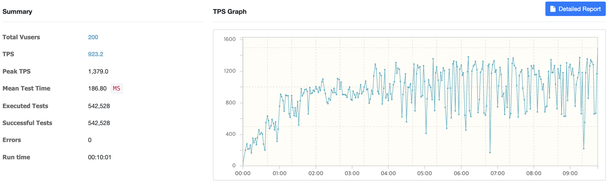
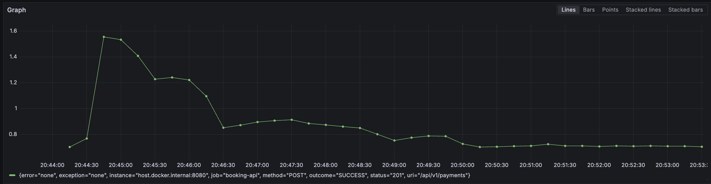
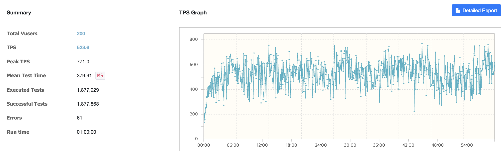
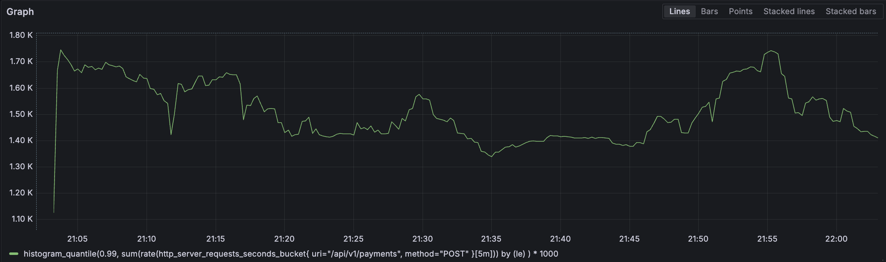

# LeoPay — 간편결제 서비스

가맹점에 카드 결제 기능을 제공하는 간편결제 시스템입니다.
단순 구현이 아닌, **장애 시나리오를 의도적으로 재현하고 신뢰성 목표를 수치로 검증**하는 것을 목표로 합니다.

> **신뢰성 목표**
>
> | 목표 | 수치 | 근거 |
> |------|------|------|
> | 중복 결제 | 동시 100 req → 0건 | 결제 시스템 핵심 불변 조건 |
> | 평균 응답시간 | ≤ 200ms | 사용자가 시스템 반응을 즉각적으로 인지하는 임계값 (Nielsen Norman Group) |
> | P99 응답시간 | ≤ 500ms | 국내 주요 PG사(토스페이먼츠 등) 결제 API SLA 수준 |
> | 에러율 | ≤ 0.1% | PG 통신 실패를 제외한 시스템 오류 허용 수준 |
> | 정산 배치 | 100만 건 5분 이내 | 익일 정산 기준, 자정 배치 완료 여유 시간 확보 |

---

## 기술 스택

| 분류 | 기술 |
|------|------|
| Language | Kotlin, Java 21 |
| Framework | Spring Boot 3.5.13 |
| API | Spring MVC, Spring WebFlux |
| ORM | Spring Data JPA, Hibernate |
| DB | MySQL, H2 (테스트) |
| Cache / Lock | Redis (분산락, 멱등성 키) |
| Messaging | Apache Kafka |
| Batch | Spring Batch |
| Monitoring | Micrometer, Prometheus, Grafana |
| Infra | Docker, Docker Compose |
| Test | nGrinder (부하 테스트) |

---

## Key Dependencies and Features

### 1. 멀티모듈 모놀리식 아키텍처
- 도메인별 모듈로 분리하여 관심사를 명확히 구분 (booking-api, mock-pg, notification-worker, settlement-worker)
- MSA가 아닌 단일 배포 단위로 운영 — 인프라 복잡도 없이 도메인 분리 효과를 취하는 의도적 선택
- 공유 모듈(core-enum, db-core, logging, monitoring)을 통해 코드 중복 최소화

### 2. Redis 분산락 (중복 결제 방지)
- 동일 paymentKey에 대한 동시 요청 시 Redisson 분산락으로 단 하나의 요청만 처리
- 락 획득 실패 시 즉시 예외 반환 — 재시도 폭발 방지
- 목표: 동시 100 req 환경에서 중복 결제 0건

### 3. Transactional Outbox Pattern (Kafka 이벤트 유실 방지)
- 결제 완료 시 DB 저장과 이벤트 발행을 하나의 트랜잭션으로 묶어 데이터 정합성 보장
- Kafka 브로커 장애 시에도 Outbox 테이블 기반으로 재발행 가능
- BEFORE_COMMIT: Outbox 테이블 저장 / AFTER_COMMIT: Kafka 발행

### 4. Kafka 기반 비동기 메시지 브로커
- 결제 완료 이벤트(`payment.completed`)를 Kafka로 발행
- notification-worker, settlement-worker가 각각 독립적으로 이벤트 소비
- 서비스 간 직접 호출 없이 느슨한 결합 실현

### 5. 알림 처리 + DLT (Dead Letter Topic)
- Kafka 컨슈머 실패 시 DLT로 이동하여 유실 없이 재처리
- 멱등성 키(Redis)로 중복 소비 방지
- DltEventConsumer가 실패 이벤트를 별도로 처리

### 6. Spring Batch 정산
- 매일 자정 스케줄러가 정산 Job을 트리거
- Reader → Processor(수수료 차감) → Writer 구조로 가맹점별 정산 금액 산출
- Skip/Retry + 재시작 포인트로 배치 장애 복구 설계
- 목표: 100만 건 기준 5분 이내 처리

### 7. Mock PG (WebFlux 기반 장애 시뮬레이션)
- 실제 PG사 없이 지연 응답, 랜덤 실패, 타임아웃을 시뮬레이션
- `PaymentGateway` 인터페이스 추상화로 실제 PG 교체 가능한 구조
- booking-api의 WebClient 타임아웃 + 폴백 처리 검증 용도

---

## 시스템 아키텍처

> TODO: 4주차 — 아키텍처 다이어그램 추가 예정

---

## 프로젝트 구조

```
leopay/
├── core/
│   └── core-enum/           # 공유 Enum (PaymentStatus, PaymentMethod 등)
├── storage/
│   └── db-core/             # JPA Entity, Repository
├── support/
│   ├── logging/             # 공통 로깅 설정
│   └── monitoring/          # Micrometer + Prometheus
├── booking-api/             # 결제 요청/승인/취소 API (port: 8080)
├── mock-pg/                 # PG사 Mock 서버 — WebFlux (port: 8081)
├── notification-worker/     # 결제 알림 처리 — Kafka Consumer
└── settlement-worker/       # 일일 정산 배치 — Kafka Consumer + Spring Batch
```

---

## 핵심 도메인

### 가맹점 (Merchant)
- 가맹점 등록 (사업자번호, 상호명, 정산 계좌, 수수료율)
- 가맹점 상태 관리 (활성 / 비활성 / 정지)

### 결제 (Payment)
- 결제 요청 → Mock PG 승인 → 결제 완료
- 결제 상태 관리: `READY → IN_PROGRESS → APPROVED → CANCEL_IN_PROGRESS → CANCELED` / `IN_PROGRESS → FAILED` / `CANCEL_IN_PROGRESS → CANCEL_FAILED`
- 전체 취소 (부분 취소는 스코프 아웃)

### Mock PG
- WebFlux 기반 비동기 서버
- 지연 응답, 랜덤 실패, 타임아웃 시뮬레이션
- `PaymentGateway` 인터페이스 추상화 → 실제 PG 교체 가능한 구조

### 알림 (Notification)
- 결제 완료 이벤트 발행 (`payment.completed` Kafka 토픽)
- 실패 시 DLT 이동 + 재처리

### 정산 (Settlement)
- Spring Batch 일일 정산 (매일 자정 기준)
- 가맹점별 결제 집계 → 수수료 차감 → 정산 금액 산출
- 정산 상태: `PENDING → COMPLETED → TRANSFERRED`
- BigDecimal 사용 (부동소수점 오차 방지)

---

## 핵심 기능 설명 및 다이어그램

> TODO: 4주차 — 핵심 기능별 플로우 다이어그램 추가 예정
> - 결제 플로우 (분산락 + Outbox 패턴)
> - 정산 배치 플로우 (Spring Batch Job 구조)
> - 장애 시나리오 재현 흐름

---

## 성능 테스트 결과

### 테스트 환경

| 항목 | 값 |
|------|-----|
| 도구 | nGrinder 3.x |
| 대상 API | `POST /api/v1/payments` (결제 생성) |
| VUser | 200 (Agent 1 × Process 20 × Thread 10) |
| Ramp-Up | 30초 (1.5초마다 1 Process 추가) |
| 실행 환경 | 로컬 (Apple Silicon, 18GB RAM) |

### 최종 결과 (튜닝 후)

| 지표 | 목표 | 실측 |
|------|------|------|
| 평균 TPS | ≥ 100 | **923.2** |
| Peak TPS | - | 1,379.0 |
| 평균 응답시간 | ≤ 200ms | **186.80ms** ✅ |
| P99 응답시간 | ≤ 500ms | 705ms |
| 총 요청 수 | - | 542,528 |
| 에러율 | ≤ 0.1% | **0%** ✅ |
| 지속 시간 | 10분 | 안정 유지 |

> P99 705ms는 단일 머신에서 모든 서비스(MySQL, Redis, Kafka, mock-pg)를 동시 실행하는 로컬 환경 한계

### nGrinder 리포트



### Grafana P99 응답시간



---

## A-1 동시 중복 요청 검증

### createPayment — 동일 paymentKey 동시 100 req (nGrinder)

| 항목 | 결과 |
|------|------|
| 동시 요청 수 | 100 VUser |
| DB 생성 건수 | **1건** (중복 결제 0건 ✅) |
| 평균 응답시간 | 285.81ms |
| P99 응답시간 | 1,850ms (락 직렬 대기 포함) |
| 에러율 | 0% (409 CONFLICT는 락의 정상 동작) |

> 100개 요청이 동일 paymentKey로 동시 진입 → 분산락이 직렬화 → DB에 1건만 INSERT

### approvePayment — 동일 paymentId 동시 1000 req (단위 테스트)

| 시나리오 | 성공 | 중복 승인 건수 |
|---------|------|--------------|
| 락 없을 때 (재현) | 10 | **10건** — 중복 발생 확인 |
| 락 있을 때 (검증) | 1 | **1건** — 분산락으로 차단 ✅ |

> 락 없이 PG 응답 지연(500ms) 구간에서 1000 스레드 동시 진입 시 10건 중복 승인 재현.
> 분산락 적용 후 동일 조건에서 APPROVED 이력 정확히 1건.

---

## 트러블슈팅

### 초기 부하 측정 결과 (튜닝 전)

| 지표 | 목표 | 실측 |
|------|------|------|
| 평균 TPS | ≥ 100 | 523.6 |
| 평균 응답시간 | ≤ 200ms | 379.91ms ❌ |
| P99 응답시간 | ≤ 500ms | 1,411ms ❌ |
| 에러율 | ≤ 0.1% | 0.003% (61건) |




### 원인 분석 및 개선

**① Hikari 커넥션 풀 기본값(10) — 응답시간 주범**

`application.yml`에 Hikari 설정이 없어 기본값 10이 적용된 상태였다. `createPayment` 한 번에 DB 쿼리가 3회 발생하는데, 200 VUser 기준으로 190개 요청이 커넥션 대기 큐에 쌓이는 구조였다.

```yaml
# 추가
datasource:
  hikari:
    maximum-pool-size: 50
    minimum-idle: 10
    connection-timeout: 5000
```

**② `existsByPaymentKey` 이중 조회**

`payment` 테이블에 `UNIQUE KEY`가 있음에도 INSERT 전에 SELECT로 중복 체크를 했다. SELECT를 제거하고 `DataIntegrityViolationException`을 catch하는 방식으로 변경해 요청당 DB 쿼리를 3회→2회로 줄였다.

```kotlin
// 변경 전: SELECT → INSERT (2회)
if (paymentRepository.existsByPaymentKey(request.paymentKey)) throw DuplicatePayment()
paymentRepository.save(payment)

// 변경 후: INSERT → 제약 위반 시 catch (1회)
try {
    paymentRepository.save(payment)
} catch (e: DataIntegrityViolationException) {
    throw PaymentException.DuplicatePayment(request.paymentKey)
}
```

**③ nGrinder 스크립트 paymentKey 충돌 버그**

`currentTimeMillis()` + 스레드 로컬 번호 조합은 동시 실행 시 같은 밀리초에서 충돌이 발생했다. `UUID.randomUUID()`로 교체해 에러 61건 → 0건으로 제거했다.

### 튜닝 결과 비교

| 지표 | 튜닝 전 | 튜닝 후 | 개선율 |
|------|--------|--------|--------|
| 평균 TPS | 523.6 | **923.2** | +76% |
| 평균 응답시간 | 379.91ms | **186.80ms** | -51% |
| P99 응답시간 | 1,411ms | **705ms** | -50% |
| 에러율 | 0.003% | **0%** | - |

---

## 스코프 아웃

- 실제 PG사 연동 (TossPayments 등)
- 부분 취소
- 실제 알림 발송 (SMS, 이메일, 푸시)
- 사용자 인증/인가 (X-User-Id 헤더로 대체 — Auth는 API Gateway 책임)
- 프론트엔드

---

## 실행 방법

```bash
# 인프라 실행 (MySQL, Redis, Kafka, Prometheus, Grafana)
docker-compose up -d

# 모듈별 실행
./gradlew :booking-api:bootRun
./gradlew :mock-pg:bootRun
./gradlew :notification-worker:bootRun
./gradlew :settlement-worker:bootRun
```
