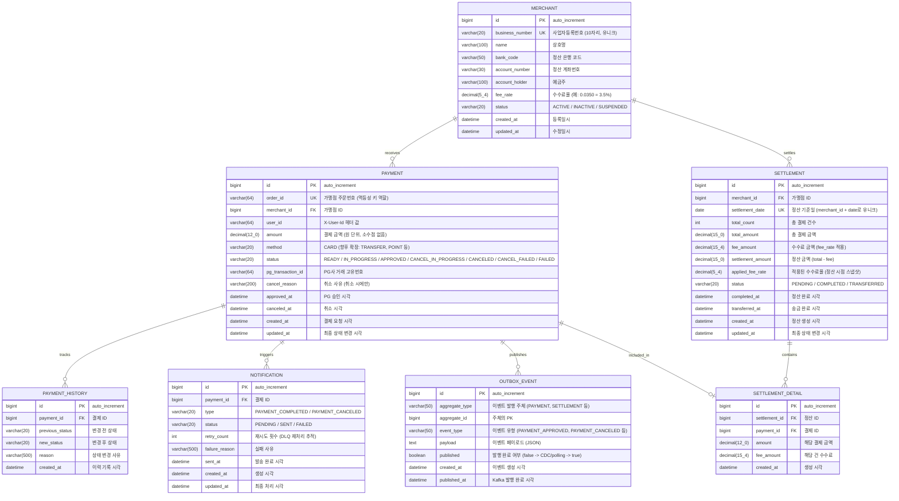

# LeoPay ERD 설계

## 1. 도메인 분석

### 핵심 엔티티 식별

| 도메인 | 엔티티 | 역할 |
|--------|--------|------|
| 가맹점 | `merchant` | 결제를 요청하는 사업자. 정산의 대상 단위 |
| 결제 | `payment` | 하나의 결제 트랜잭션. 상태 머신으로 생명주기 관리 |
| 결제 | `payment_history` | 결제 상태 변경 이력. 감사(audit) 및 디버깅 용도 |
| 정산 | `settlement` | 일일 정산 단위. 가맹점별 하루치 결제를 집계 |
| 정산 | `settlement_detail` | 정산에 포함된 개별 결제 건. settlement:payment = 1:N 매핑 |
| 알림 | `notification` | 결제 완료 알림 발송 기록. DLQ 재처리 추적 |
| 신뢰성 | `outbox_event` | Transactional Outbox Pattern용 이벤트 테이블 |

### 제외 사항
- 사용자(User) 테이블: Auth는 API Gateway 책임이므로 `X-User-Id` 헤더 값만 payment에 기록
- 카드/결제수단 테이블: Mock PG 구조이므로 payment 내 필드로 충분

---

## 2. ERD (Mermaid)



---

## 3. 테이블별 설계 근거

### 3.1 MERCHANT (가맹점)

| 설계 포인트 | 근거 |
|------------|------|
| `business_number` UNIQUE | 동일 사업자 중복 등록 방지. 사업자등록번호는 10자리 고정이나 하이픈 포함 고려하여 varchar(20) |
| `fee_rate` decimal(5,4) | 수수료율은 0.0000~9.9999 범위. 3.5%는 0.0350으로 저장. BigDecimal 매핑 |
| `status` varchar(20) | Enum 매핑 (ACTIVE/INACTIVE/SUSPENDED). core-enum 모듈에서 관리 |
| 정산 계좌 정보 내장 | 가맹점당 정산 계좌가 1:1이므로 별도 테이블 불필요. 변경 이력이 필요해지면 분리 고려 |

### 3.2 PAYMENT (결제)

| 설계 포인트 | 근거 |
|------------|------|
| `order_id` UNIQUE | 가맹점이 발급하는 주문번호. 멱등성 키의 DB 레벨 보장 (Redis TTL 만료 후에도 중복 방지) |
| `user_id` varchar(64) | FK 없음. Auth가 API Gateway 책임이므로 식별값만 저장 |
| `amount` decimal(12,0) | 원화 기준 소수점 없음. 최대 9,999억원까지 표현 |
| `pg_transaction_id` | PG사 응답의 거래번호. 대사(reconciliation) 및 취소 요청 시 사용 |
| `approved_at`, `canceled_at` | 상태별 시각을 분리하여 조회/정산 시 명확한 기준 제공 |
| `status` | 아래 상태 전이 다이어그램 참고. payment_history로 전이 이력 추적 |

#### 상태 정의

| 상태 | 설명 |
|------|------|
| `READY` | 결제 건 생성됨. 아직 PG사에 요청 안 보냄 |
| `IN_PROGRESS` | PG사에 승인 요청 보냄, 응답 대기 중. 동일 건 중복 요청 방지 역할 |
| `APPROVED` | PG사 승인 완료. 카드에서 출금된 상태 |
| `FAILED` | PG사 승인 거절 (카드 한도 초과, 카드 정지 등) |
| `CANCEL_IN_PROGRESS` | PG사에 취소 요청 보냄, 응답 대기 중 |
| `CANCELED` | PG사 취소 완료. 카드에 환불 처리됨 |
| `CANCEL_FAILED` | PG사 취소 요청 실패 (PG 장애, 네트워크 타임아웃 등) |

#### 상태 전이

```
READY → IN_PROGRESS → APPROVED → CANCEL_IN_PROGRESS → CANCELED
                    ↘ FAILED                         ↘ CANCEL_FAILED
                                                        ↙ ↘
                                          CANCEL_IN_PROGRESS  APPROVED
                                            (재시도)          (취소 포기)
```

| 전이 | 트리거 |
|------|--------|
| READY → IN_PROGRESS | PG사에 승인 요청 발송 |
| IN_PROGRESS → APPROVED | PG사 승인 응답 수신 |
| IN_PROGRESS → FAILED | PG사 거절 응답 또는 타임아웃 |
| APPROVED → CANCEL_IN_PROGRESS | 사용자 취소 요청, PG사에 취소 발송 |
| CANCEL_IN_PROGRESS → CANCELED | PG사 취소 완료 응답 |
| CANCEL_IN_PROGRESS → CANCEL_FAILED | PG사 취소 실패 (장애, 타임아웃) |
| CANCEL_FAILED → CANCEL_IN_PROGRESS | 취소 재시도 |
| CANCEL_FAILED → APPROVED | 취소 포기, 결제 유지로 롤백 |

### 3.3 PAYMENT_HISTORY (결제 이력)

| 설계 포인트 | 근거 |
|------------|------|
| 별도 테이블 분리 | payment 테이블은 현재 상태만 보관 (조회 성능). 이력은 별도 추적 (감사 로그) |
| `previous_status` + `new_status` | 상태 전이를 명시적으로 기록. 비정상 전이 탐지 가능 |
| `reason` | 실패 사유, 취소 사유 등을 이력 단위로 기록 |

### 3.4 NOTIFICATION (알림)

| 설계 포인트 | 근거 |
|------------|------|
| `retry_count` | DLQ 재처리 횟수 추적. 최대 재시도 횟수 정책 적용 가능 |
| `status` | PENDING(생성) -> SENT(성공) / FAILED(최종실패). Kafka Consumer 처리 결과 기록 |
| `failure_reason` | 실패 원인 분석용. DLQ에서 재처리 판단 근거 |

### 3.5 SETTLEMENT (정산)

| 설계 포인트 | 근거 |
|------------|------|
| `merchant_id` + `settlement_date` UNIQUE | 가맹점별 하루에 하나의 정산만 생성. Spring Batch 재실행 시 멱등성 보장 |
| `applied_fee_rate` | 정산 시점의 수수료율 스냅샷. 가맹점 수수료율이 변경되더라도 정산 정확도 보장 |
| `fee_amount` decimal(15,4) | 수수료 계산 중간값에 소수점 발생 가능. 최종 정산금액은 반올림하여 정수 |
| `settlement_amount` | total_amount - fee_amount의 결과. 역정규화이나 정산 조회 빈도가 높아 비정규화 허용 |
| 상태 머신 | PENDING -> COMPLETED(집계완료) -> TRANSFERRED(송금완료) |

### 3.6 SETTLEMENT_DETAIL (정산 상세)

| 설계 포인트 | 근거 |
|------------|------|
| settlement:payment 매핑 | 정산에 포함된 개별 결제 건을 추적. 정산 검증 및 대사(reconciliation) 용도 |
| `amount`, `fee_amount` 중복 저장 | 정산 시점의 값을 스냅샷. payment의 금액이 사후 변경되어도 정산 무결성 유지 |

### 3.7 OUTBOX_EVENT (아웃박스 이벤트)

| 설계 포인트 | 근거 |
|------------|------|
| Transactional Outbox Pattern | DB 트랜잭션과 Kafka 발행의 원자성 보장. 결제 상태 변경 시 같은 트랜잭션에 outbox INSERT |
| `aggregate_type` + `aggregate_id` | 다형성 지원. PAYMENT, SETTLEMENT 등 다양한 이벤트 소스 대응 |
| `published` boolean | Polling Publisher가 false인 행을 조회하여 Kafka 발행 후 true로 변경 |
| `payload` text | JSON 직렬화된 이벤트 데이터. 스키마 유연성 확보 |

---

## 4. 인덱스 전략

### 4.1 Primary Key (자동 생성)

모든 테이블에 `BIGINT AUTO_INCREMENT` PK. 클러스터드 인덱스로 INSERT 순서 보장.

### 4.2 Unique Index

| 테이블 | 컬럼 | 용도 |
|--------|------|------|
| `merchant` | `business_number` | 사업자번호 중복 방지 |
| `payment` | `order_id` | 멱등성 키. Redis TTL 만료 후 DB 레벨 최종 방어선 |
| `settlement` | `(merchant_id, settlement_date)` | 가맹점별 일일 정산 유일성 보장 |

### 4.3 일반 Index

| 테이블 | 인덱스 | 컬럼 | 용도 |
|--------|--------|------|------|
| `payment` | `idx_payment_merchant_status` | `(merchant_id, status)` | 가맹점별 결제 상태 조회 (정산 배치 Reader) |
| `payment` | `idx_payment_merchant_approved` | `(merchant_id, approved_at)` | 정산 배치: 특정 일자의 승인 건 조회 |
| `payment` | `idx_payment_user` | `(user_id, created_at)` | 사용자별 결제 내역 조회 API |
| `payment` | `idx_payment_created` | `(created_at)` | 일자 범위 조회 (관리자 화면) |
| `payment_history` | `idx_history_payment` | `(payment_id, created_at)` | 특정 결제의 상태 변경 이력 조회 |
| `notification` | `idx_notification_status` | `(status, created_at)` | FAILED 상태 알림 재처리 조회 |
| `notification` | `idx_notification_payment` | `(payment_id)` | 특정 결제의 알림 조회 |
| `settlement` | `idx_settlement_status` | `(status)` | 상태별 정산 조회 (PENDING 건 처리) |
| `settlement` | `idx_settlement_date` | `(settlement_date)` | 일자별 정산 현황 조회 |
| `settlement_detail` | `idx_detail_settlement` | `(settlement_id)` | 정산별 상세 내역 조회 |
| `settlement_detail` | `idx_detail_payment` | `(payment_id)` | 특정 결제의 정산 포함 여부 확인 |
| `outbox_event` | `idx_outbox_unpublished` | `(published, created_at)` | Polling Publisher 핵심 쿼리: 미발행 이벤트 조회 |

### 4.4 인덱스 설계 원칙

1. **복합 인덱스 컬럼 순서**: 카디널리티가 높은 컬럼을 앞에 배치 (merchant_id > status)
2. **커버링 인덱스 고려**: 정산 배치의 Reader 쿼리는 인덱스만으로 결과를 반환하도록 설계
3. **outbox polling 최적화**: `(published, created_at)` 인덱스로 미발행 이벤트를 created_at 순서로 조회. published=true로 변경되면 인덱스에서 자연 제거
4. **과도한 인덱스 방지**: INSERT 성능과의 트레이드오프 고려. payment 테이블은 동시 100req 목표이므로 인덱스 수를 최소화

---

## 5. 정규화 검토

### 제1정규형 (1NF)
- 모든 컬럼이 원자값. 복합 값 없음.

### 제2정규형 (2NF)
- 모든 테이블이 단일 PK(id). 부분 종속 없음.

### 제3정규형 (3NF)
- `settlement.settlement_amount`는 `total_amount - fee_amount`로 계산 가능하여 이행 종속이나, 정산 조회 빈도와 정확도를 위해 의도적 비정규화.
- `settlement_detail.amount`, `settlement_detail.fee_amount`는 정산 시점 스냅샷으로 의도적 비정규화.

### 비정규화 근거
| 비정규화 항목 | 사유 |
|-------------|------|
| `settlement.settlement_amount` | 정산 조회 시 매번 계산 회피. 배치에서 한 번만 계산 |
| `settlement.applied_fee_rate` | 가맹점 수수료율 변경에 대한 시점 보장 |
| `settlement_detail` 금액 필드 | 결제 원본 변경과 무관하게 정산 무결성 유지 |
